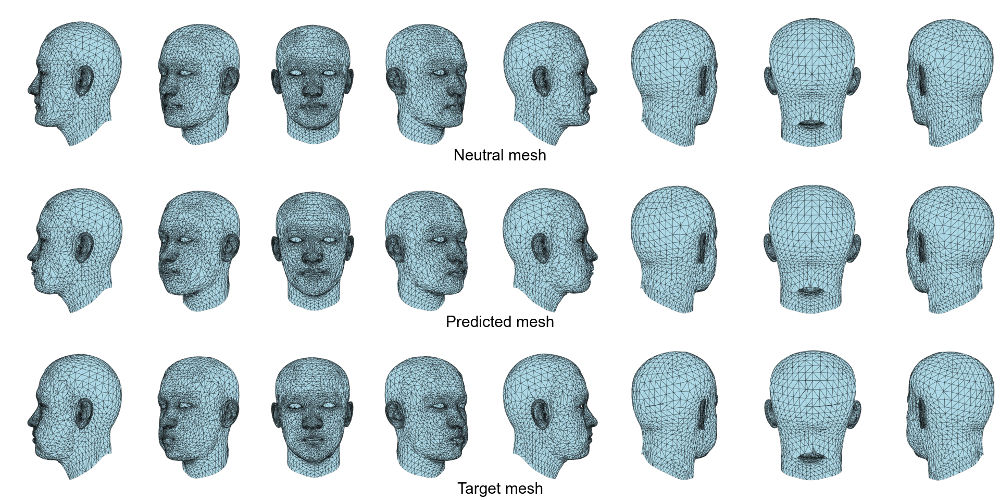
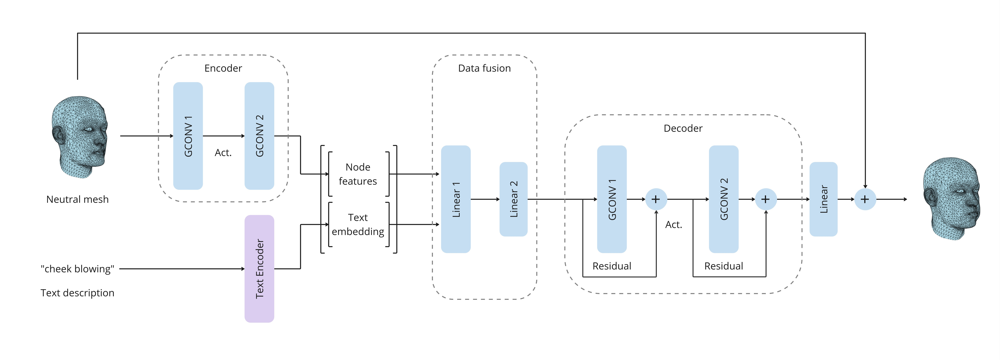
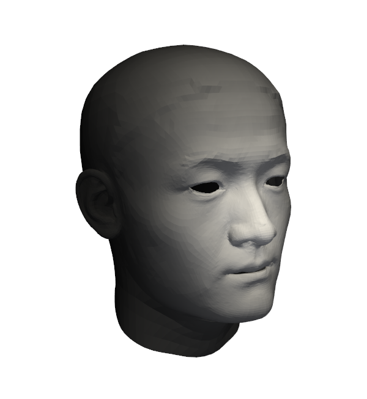
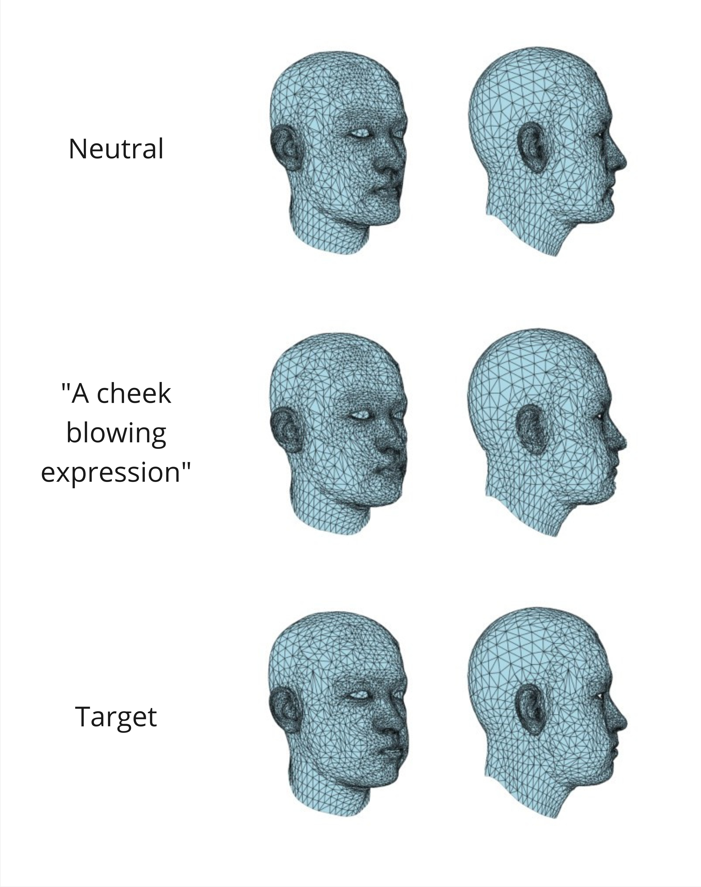

# A Graph-Based Approach to Realistic Facial Expressions

<!--
## ⚠️ Work in Progress

This project is actively under development. Features are being added, refined, and tested continuously.
-->

## 👀 Overview

This project leverages Graph Convolutional Neural Networks and data fusion techniques. The model conditions vertex displacements of a neutral expression mesh based on textual descriptions to produce the desired realistic facial expression.



## 🛠 Setup

```bash
conda env create -f environment.yml
conda activate rfe
```

## 🚀 Training

To train the model from scratch you will need to preprocess the dataset. We used [Facescape](https://facescape.nju.edu.cn/), a large-scale detailed 3D face dataset. The meshes are very resolute, so we also had to simplify them to reduce the computational burden. More on the real preprocessing that comes afterwards can be read in the [preprocessing section](#-preprocessing-step).

- Simplify the meshes
    ```bash
    python src/test/simplify_meshes.py -s datasets/facescape -d datasets/facescape_simplified
    ```

- Apply a weight to key regions
    ```bash
    python src/test/highlight.py -s datasets/facescape_simplified -d datasets/facescape_highlighted
    ```

After this, you can run the training script. Considering the amount of parameters we might need to tune, we used a configuration file (`config.py`). Edit the file according to your needs (e.g. change dataset folder, training parameters, ...) before continuing:

```bash
python src/models/gnn/train.py
```

## Inference

To perform inference after training:

```bash
python src/models/gnn/inference.py -m datasets/facescape_highlighted/<user_in_test_set>/models_reg/1_neutral.obj -t "Smiling"
```

## ⚙️ How It Works



Our architecture consists of several components:

1. **Graph Encoder** - Maps each vertex of a 3D mesh into a latent space.
2. **Conditioning block** - Fuses together the latent representation of each vertex with the text description of the expression we want. This ensures that the facial expressions align with the input prompts.
3. **Graph Decoder** - Translates the encoded features into vertex displacements, which are then applied to the base mesh to generate the final facial expression. The displacements are summed to the base mesh, rather than directly predicting output meshes, in order not to excessively distort the subject.

## 🛠 Preprocessing Step

Before training the model, we preprocess the 3D meshes. This step includes:
- **Mesh Simplification**: Reducing the number of vertices while maintaining essential facial features to optimize computational efficiency.
- **Alignment**: Ensuring that all meshes share the same orientation and scale to facilitate training.
- **Weighting Mechanism**: Assigning higher importance to key facial regions, allowing the model to focus on the most expressive areas.
- **Text Generation**: Automatically generating text descriptions for each mesh based on predefined labeling rules.

To assign a weight to key region on the mesh, a simple preprocessing script increases a weight on the front of the mesh (after alignment all have the same orientation in space), where the totality of the facial features are. We recognize that this is a naive approach to the problem, future work can be devoted to improving this process, perhaps by introducing a dedicated model (e.g. 2D facial feature recognition projected on the 3D mesh).



## ✨ Key Features
- **Large-Scale Dataset**: Trained on the FaceScape dataset, which includes 18,000+ high-quality 3D face models with 20 distinct expressions from 938 individuals.
- **Text-Driven Animation**: Conditions vertex displacements on textual descriptions, allowing for flexible control over expressions.
- **Weighted Mesh Processing during preprocessing**: Dynamically adjusts vertex weights to prioritize regions critical for facial expressions, ensuring natural and realistic deformations.
- **Loss Function**: Incorporates Chamfer distance, normal consistency regularization, and Laplacian smoothing to maintain structural integrity and minimize artifacts.

## 🎯 Results

Shown below, the model in action. As mentioned, more elaborate NLP techniques can be used to create the expression description during training, so we stuck with a basic prompt mirroring the structure the model saw during training.
Top, the starting mesh; middle, what the model produced based on the prompt - bulges on the cheeks; bottom, the mesh corresponding to “cheek blowing” in the dataset, which the model obviously did not see. Much more could be done but the results are promising.



## 👷 Limitations & Future Work
While the model demonstrates promising results, there are areas for improvement:
- **Expressiveness**: The current approach relies on simple text descriptions derived from filenames. Future work could explore more sophisticated natural language processing techniques to enhance expressiveness.
- **Feature Identification**: The weighting mechanism for different facial regions can be refined to better capture key features and improve animation quality.
- **Extreme Expressions**: The model struggles with highly exaggerated expressions (e.g., closed eyes). Adjustments to the loss function or alternative latent space navigation strategies may help address this issue.

## 🤝 Contribution

Feel free to contribute by opening issues or submitting pull requests. Give a ⭐️ to this project if you liked the content.
